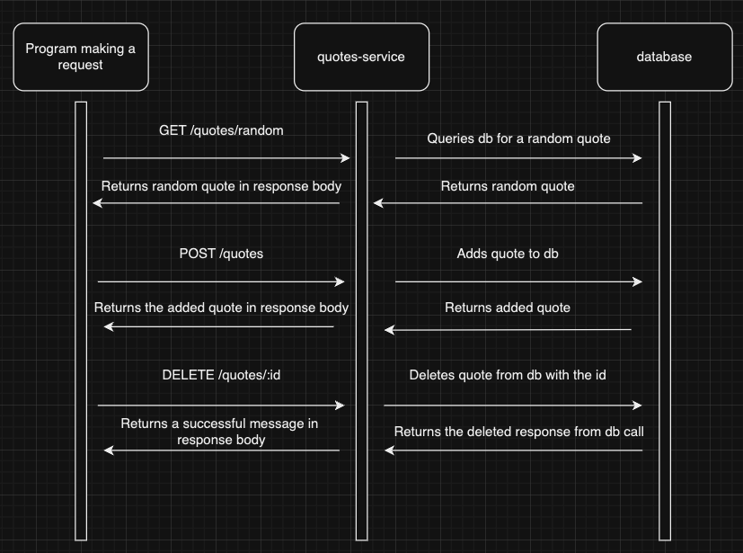

# Quotes Service

A service that allows adding quotes, generating random stored quotes, and deleting quotes.

## Setup

1. Copy .env.example to .env file
2. Add your Postgresql uri to `DATABASE_URL` in the .env file
3. Install dependencies with `npm install`
4. Start the app run `npm run start`

## Requesting data and Receiving data
The communication contract is HTTP requests.

### Get a random stored quote
GET /quotes/random

Example call:
curl -X GET localhost:3000/quotes/random

Example response:
{ "id": 6, "text": "Test quote 10" }

### Add a new quote
POST /quotes
Send a JSON object with a `text` key containing the quote you want to save.

Example call:
curl -X POST localhost:3000/quotes -H "Content-Type: application/json" -d '{"text": "Test quote"}'

Example response:
{ "id": 10, "text": "Test quote 2" }

### Delete an existing quote
DELETE /quotes/:id

Example call:
curl -X DELETE localhost:3000/quotes/10

Example response:
{ "message": "Quote deleted successfully." }

## UML diagram
